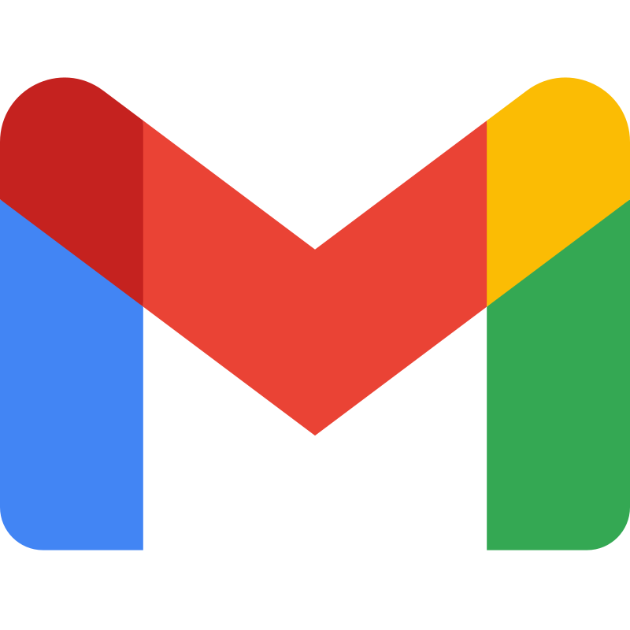

<!--
  anxchywl / profile README
  Warm space-age colors, sharp type, quiet motion.
  The copy is intentionally plain; the visuals carry the personality.
-->

  

  
  &nbsp;&nbsp;&nbsp;&nbsp;
  
  &nbsp;&nbsp;&nbsp;&nbsp;
  

### The stack

Python | TypeScript | Next.js | Flutter | FastAPI | PostgreSQL | Redis | Docker | GitHub Actions

### Projects

**NUmer**&nbsp;&nbsp;[App Store](https://apps.apple.com/kz/app/numer-app/id6759787785) | [Google Play](https://play.google.com/store/apps/details?id=app.anx.numer) | [anxchywl/NUmer](https://github.com/anxchywl/NUmer) 
Study and productivity app (200+ active users)

Focus timers, habits, calendars, and study groups in one offline-first app for iOS and Android. Changes save to Hive on the device first and sync to Firestore in batches under its write limit, with a guard that stops a new device from overwriting your cloud profile.

**Student Events**&nbsp;&nbsp;[@student_events_bot](https://t.me/student_events_bot) | [anxchywl/EventsBot](https://github.com/anxchywl/EventsBot) 
Campus event platform for Nazarbayev University

A student Mini App, coordinator app, Telegram bot, and admin panel on one backend, with auto-updating dashboards pinned in Telegram groups. Edits and their sync jobs commit in one transaction, and leased workers retry if they crash. Now growing into a student super-app with the Blockchain & Fintech Lab.

**Wished**&nbsp;&nbsp;[@wished_app_bot](https://t.me/wished_app_bot) | [anxchywl/Wished](https://github.com/anxchywl/Wished) 
Social wishlists and group gifts (50+ users)

Share a wishlist in Telegram and friends reserve or chip in on gifts, while the owner never learns who reserved what, not even from counts or ordering. Simultaneous reservations are race-free through transactions and unique constraints, and marketplace link previews are protected against SSRF.

**Loci**&nbsp;&nbsp;[loci.anxchywl.dev](https://loci.anxchywl.dev) | [@loci_app_bot](https://t.me/loci_app_bot) | [anxchywl/Loci](https://github.com/anxchywl/Loci) 
Trilingual story map (20+ users)

Pin the places that shaped you and the stories behind them, on the web or in Telegram. Exact coordinates never leave the server; approximate pins use a deterministic HMAC offset that can't be averaged away, and map clusters are cached in Redis with stampede protection.

**Aspectus**&nbsp;&nbsp;[anxchywl/Aspectus](https://github.com/anxchywl/Aspectus) 
Eye-contact correction for macOS (technical preview)

Tracks your eyes with Vision, redraws them on Metal, and publishes the result as a virtual camera for any video call app. Vision runs at 6.71 ms p95 and the warp at 1.32 ms, and a 97.6-minute soak test pushed out 136,479 frames without a backlog.

**Muto**&nbsp;&nbsp;[anxchywl/Muto](https://github.com/anxchywl/Muto) 
Marketplace for verified university students

Sell, swap, or give away things on campus, built as an embeddable feature for NU's student super-app. Retries are made safe with advisory locks and idempotency keys, and the layered architecture is enforced by tests.

**Gradus**&nbsp;&nbsp;[anxchywl/Gradus](https://github.com/anxchywl/Gradus) 
GPA tracker (in progress)

Tracks courses by semester and computes a credit-weighted GPA that gets the edge cases right, like ungraded work and pass/fail credits. Grades can be imported straight from a PDF or Word syllabus.

**Clavis**&nbsp;&nbsp;[anxchywl/Clavis](https://github.com/anxchywl/Clavis) 
NU Piano Room booking (in progress)

Book weekly one-hour practice slots, up to two per student. A unique slot index and request IDs rule out double bookings, with every rule checked on the server.

**Google Datathon NU**&nbsp;&nbsp;[gdg.anxchywl.dev](https://gdg.anxchywl.dev) | [anxchywl/GoogleDevelopersGroup](https://github.com/anxchywl/GoogleDevelopersGroup) 
Sponsorship site for GDG on Campus NU

A trilingual static site with a strict hash-based CSP, served from a read-only, non-root container. Deploys pass automated and Playwright checks and roll back on their own if a health check fails.

**Iter**&nbsp;&nbsp;[anxchywl/iter](https://github.com/anxchywl/iter) 
Summer Work Travel job directory for Kazakhstan

Browse current listings and reach employers directly, in the browser or Telegram, with no accounts or uploads. One script runs migrations, tests, smoke checks, and security scans in a throwaway environment.

**KaushVoiceKey**&nbsp;&nbsp;[anxchywl/KaushVoiceKey](https://github.com/anxchywl/KaushVoiceKey) 
Hybrid voice and keyboard input

Type a word's first letter, say the word, and the full word lands in whatever app you're using. Speech recognition runs fully offline.

**DocumentToMarkdown**&nbsp;&nbsp;[anxchywl/DocumentToMarkdown](https://github.com/anxchywl/DocumentToMarkdown) 
Local document converter

Turns PDFs and Office files into Markdown without anything leaving your machine. When a PDF's text is broken, it falls back to on-device OCR.

**Pong**&nbsp;&nbsp;[anxchywl/Pong](https://github.com/anxchywl/Pong) 
Unity 6 take on the arcade classic

One to four local players on keyboard, gamepad, or touch, with Retro and Futuristic themes you can switch mid-game.

